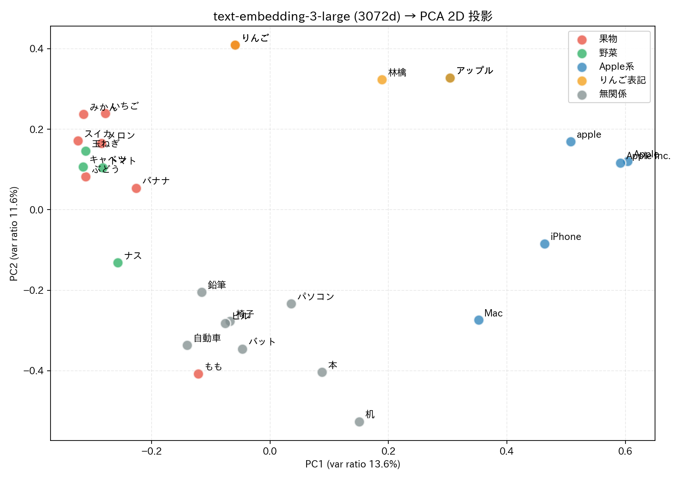

# embedding-explore

OpenAI `text-embedding-3-large` (3072次元) を使って単語 embedding を解剖した実験リポジトリ。

関連記事: 「[りんごのベクトルを覗いたら、Apple と林檎が別人だった話](https://qiita.com/masafy/items/4473222f8e8fd472b5ee)」(Qiita)



横軸 PC1 が「果物極 ⇔ Apple企業極」の意味勾配になっており、`りんご → 林檎 → アップル` が表記の違いだけで両極の間をなめらかに移動している様子が観察できる。

## 何を調べたか

- `text-embedding-3-large` (3072次元) で単語ベクトルを取得し、コサイン類似度で意味の近さを計測
- 「りんご」⇔「みかん」= 0.57、`apple` ⇔ `Apple` = 0.87 など、表記の違いが意味距離をどう動かすかを定量化
- 「特定の次元 N が果物概念を担当している」という素朴な解釈の反証（分散表現の実証）
- 平均差分による**コンセプトベクトル**を構成し、新規語に「果物っぽさスコア」を線形射影で付与

詳細な解釈とまとめは Qiita 記事を参照。

## 構成

```
embedding-explore/
├── article/public/*.md            # Qiita 記事ソース (qiita-cli管理)
├── scripts/run_experiment.py      # API取得 + 全実験の再現スクリプト (標準ライブラリのみ)
├── scripts/visualize_pca.py       # PCA 2D 散布図生成 (numpy/matplotlib)
├── data/embeddings.json           # キャッシュ済み embedding (34語, 3072次元)
└── data/pca_scatter.png           # 生成された散布図
```

## 再現

OPENAI_API_KEY を発行できる環境が必要。embedding 取得分の API 料金は数円以下。

```bash
git clone https://github.com/masafykun/embedding-explore.git
cd embedding-explore
export OPENAI_API_KEY=sk-...

# 1. 実験を再現（同梱の embeddings.json があれば API は叩かれない）
python3 scripts/run_experiment.py

# 2. PCA 散布図を生成
pip install numpy matplotlib japanize-matplotlib
python3 scripts/visualize_pca.py
# → data/pca_scatter.png が生成される
```

### 自分の単語で試す

`scripts/run_experiment.py` 内の `FRUITS` / `NON_FRUITS` / `TEST` のリストを書き換えれば、別ドメインのコンセプトベクトル (例: ポジティブ語 vs ネガティブ語、フォーマル vs カジュアル) を作って射影スコアを取れる。

## 参考

- [OpenAI Embeddings ドキュメント](https://platform.openai.com/docs/guides/embeddings)
- TCAV: Kim et al. 2018, "Interpretability Beyond Feature Attribution"
- Anthropic, "Toy Models of Superposition" Elhage et al. 2022

## ライセンス

MIT
